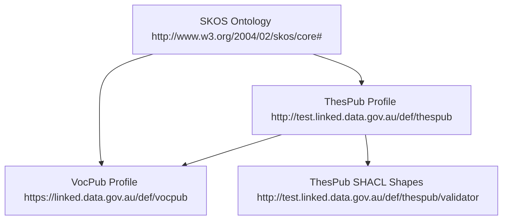

# ThesPub – Thesaurus-Friendly Extension to VocPub (Draft)

## Status
This repository is an **early-stage discussion space** for a possible thesaurus-oriented extension profile building on VocPub and SKOS. Nothing here is final; everything is open for change. This work benefited from exploratory use of generative AI tools during drafting. Responsibility for content rests entirely with the authors.

## Motivation
- VocPub works very well for small, flat, domain vocabularies.
- Richer thesaurus-style vocabularies (deep hierarchies, associations,
multilingual labels) sometimes bump into limitations such as:
- global single `skos:prefLabel`
- mandatory `skos:definition`
- limited or no treatment of `skos:altLabel` and `skos:related` patterns.

ThesPub explores ways to support those use cases **without changing** VocPub itself, by defining an optional profile that:
- is a profile of SKOS using W3C PROF,
- reuses VocPub's publishing constraints,
- relaxes some VocPub modelling rules, and
- adds thesaurus-friendly recommendations.

## Repository layout
- `docs/` – discussion paper(s) for LDWG and other fora.
- `profiles/` – PROF description of the ThesPub profile and machine-readable requirements (e.g., THES-01, THES-02, THES-03…).
- `shacl/` – SHACL shapes that implement the requirements.
- `examples/` – small SKOS vocabularies for testing.

## Getting involved
- Open issues to discuss requirements, shapes, and scope.
- Propose alternatives to the current naming, IRIs, and constraints.
- Suggest additional use cases where a thesaurus-oriented profile
would help.

This work is intended to complement, not replace, VocPub, and to be
shaped collaboratively with interested communities.
